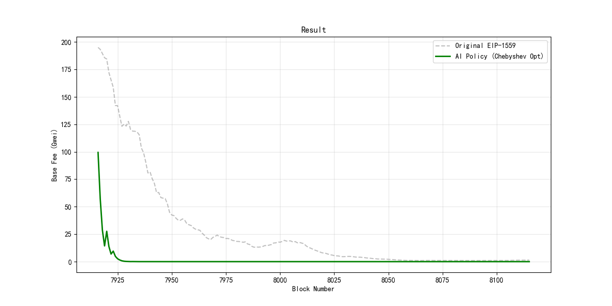

## 项目概述

以太坊目前的 **EIP-1559** 费率机制旨在通过使交易费用更具可预测性来改善用户体验 。然而，它面临着一个固有的多目标优化冲突：
1.  **网络效率 (Network Efficiency)：** 高效利用区块空间（目标是将 Gas 使用量维持在 15M 左右）。
2.  **费率稳定性 (Fee Stability)：** 降低基础费率 (Base Fee) 的剧烈波动，避免价格冲击。

本项目构建了一个包含 **Layer-2 迁移特征** 和 **市场情绪因子** 的高保真以太坊仿真环境，并应用 **深度强化学习 (PPO)** 来优化费率更新机制。

我们对比了两种多目标优化的标量化方法：
* **线性加权和 (Weighted Sum - Baseline)**
* **切比雪夫标量化 (Chebyshev / Min-Max - Proposed Method)**

##  核心特性

* **动态仿真环境：** 基于 Gym 接口构建的 `EthereumFeeEnv`，基于历史概率分布模拟了用户交易到达、Layer-2 流量爆发 (L2 Spikes) 以及 ETH 价格跳变。
* **多目标评价框架：** 理论上对齐了社会福利、公平性 (Fairness) 和抗合谋 (Anti-Collusion) 等评价指标。
* **Min-Max 优化算法：** 实现了切比雪夫标量化方法，能够动态惩罚当前表现“最差”的目标，有效防止智能体过拟合单一指标。

## 结果摘要

实验结果表明，与传统的加权和方法相比，**Min-Max (Chebyshev)** 算法在保持高 Gas 效率的同时，显著提升了费率的稳定性。

| 算法策略                      | 费率波动性 (Gwei) | Gas 目标偏差 (M) | 综合表现     |
| :------------------------ | :----------: | :----------: | :------- |
| **EIP-1559 (基线)**         |    0.0521    |     6.08     | 标准       |
| **加权和 RL (Weighted Sum)** |    0.1989    |   **5.04**   | 波动极大     |
| **Min-Max RL (本文)**       |  **0.0047**  |     5.55     | **最佳平衡** |
|                           |              |              |          |

> *注：相比加权和方法，Min-Max 算法将费率波动性降低了约 **97.6%**。*


*(图 1. 轨迹对比：展示了 Min-Max 策略对费率曲线的平滑效果)*

## 🛠️ 安装与使用

### 1. 环境依赖
请确保安装了 Python 3.8+。使用 pip 安装所需依赖：

```bash
pip install gymnasium stable-baselines3 pandas numpy matplotlib shimmy
````

### 2. 项目结构

- `EIP1559_RL_Simulation.ipynb`: 核心 Notebook，包含环境定义、PPO 智能体训练及评估逻辑。
    
- `ethereum_history.csv`: 由高级仿真引擎生成的合成数据（运行代码时会自动生成）。
    

### 3. 运行仿真

直接打开 Jupyter Notebook 并运行所有单元格即可。流程包括：

1. **数据生成：** 模拟包含 L2 爆发期的区块历史数据。
    
2. **模型训练：** 使用自定义奖励函数训练 PPO 智能体（约 30,000 步）。
    
3. **对比评估：** 将 RL 智能体的决策轨迹与原生 EIP-1559 规则进行对比绘图。
    

## 方法论

### 奖励函数：切比雪夫标量化 (Chebyshev Scalarization)

不同于简单的线性加权求和，我们采用 Min-Max 方法来优化当前状态距离理想点 $z^*$ 的切比雪夫距离：

$$R_t^{Cheb} = - \max_{k \in \{stab, eff\}} \left( w_k \cdot | r_{t,k} - z^*_k | \right)$$

这种机制迫使智能体必须关注当前表现最差的那个目标，从而形成负反馈回路，抑制极端的费率震荡。
